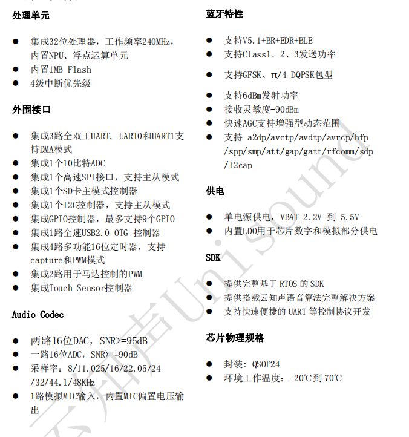

# 蜂鸟B

## 简介

&emsp;&emsp;US665 芯片是一款蓝牙双模智能语音 IoT 芯片。芯片集成 32 位 CPU 处理器，包含 UART、GPIO、SPI、SD 卡、I2C、ADC、TouchSensor 等外围接口；内置 NPU、浮点运算单元。依托于云知声在语音识别技术上的积累和算法的不断优化和创新，将本地识别算法与芯片架构深度融合，为客户提供 Turnkey 语音识别方案。 &emsp;&emsp;该芯片采用 MCU 加语音识别专用 NPU 架构内核，同时芯片内置 SRAM 和 FLASH，只需少量外围器件即可形成完整解决方案。 &emsp;&emsp;该方案支持 50 条本地指令离线 3-5 米远场识别，支持 RTOS 轻量级系统，并提供简洁友好的客制化工具，可快速部署到不同的终端产品上。适用于用于智能家电、智能家居、智能玩具、无线音视频、工业控制、医疗监护等广泛的物联网领域。

### 主要特点

## 文档下载

[蜂鸟B(US665) SOC产品手册.pdf](../../_static/document/Chip/fnB/%E8%9C%82%E9%B8%9FB(US665)%20SOC%E4%BA%A7%E5%93%81%E6%89%8B%E5%86%8C.pdf)

[蜂鸟B参考原理图.pdf](../../_static/document/Chip/fnB/%E8%9C%82%E9%B8%9FB%E5%8F%82%E8%80%83%E5%8E%9F%E7%90%86%E5%9B%BE.pdf)

[蜂鸟B离线方案开发指导手册(通用版本).chm](../../_static/document/Chip/fnB/%E8%9C%82%E9%B8%9FB%E7%A6%BB%E7%BA%BF%E6%96%B9%E6%A1%88%E5%BC%80%E5%8F%91%E6%8C%87%E5%AF%BC%E6%89%8B%E5%86%8C(%E9%80%9A%E7%94%A8%E7%89%88%E6%9C%AC).chm)

[蜂鸟B离线方案开发指导手册(BLE版本).chm](../../_static/document/Chip/fnB/%E8%9C%82%E9%B8%9FB%E7%A6%BB%E7%BA%BF%E6%96%B9%E6%A1%88%E5%BC%80%E5%8F%91%E6%8C%87%E5%AF%BC%E6%89%8B%E5%86%8C(BLE%E7%89%88%E6%9C%AC).chm)
