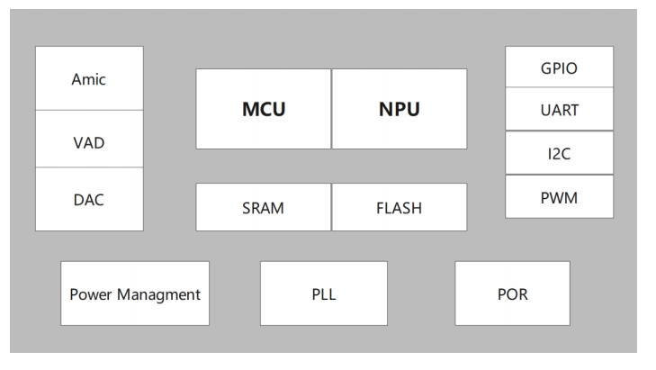
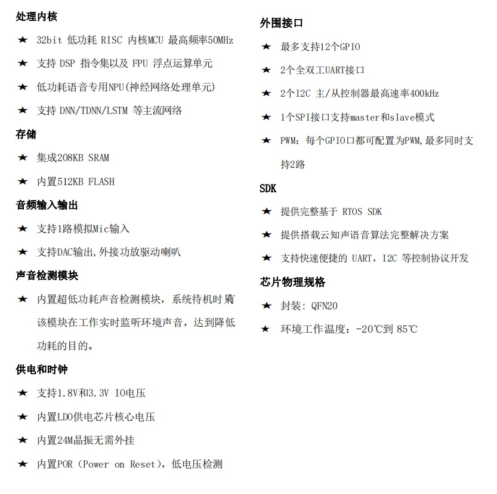

# 蜂鸟L

## 简介

&emsp;&emsp;US513U6 是一颗亚毫瓦级超低功耗面向带电池和便携式产品以及对功耗有严苛要求的各类产品推出的智能纯离线语音识别芯片，依托于云知声在语音识别技术上的积累和算法的不断优化和创新，将离线识别算法与芯片架构深度融合，为客户提供 Turnkey 语音识别方案，可广泛且快速应用于各类带电池的小家电，可穿戴，玩具以及单火线供电 86 盒等需要语音操控的产品。 &emsp;&emsp;该芯片采用 MCU+语音识别专用 NPU 架构内核，采用超低功耗制程工艺，内置高精度语音检测模块配合系统多级启动模式使芯片待机功耗进入亚毫瓦级，工作功耗几毫瓦级别，芯片内置 SRAM 和FLASH 只需少量外围器件即可形成完整解决方案。 &emsp;&emsp;该方案支持 50 条本地指令离线 3-5 米远场识别，支持 RTOS 轻量级系统，具有丰富的外围接口，并提供简洁友好的客制化工具，可快速部署到不同的终端产品上。

### 功能框图

### 主要特点

## 文档下载

[蜂鸟L(US513U6) SOC产品手册_V1.0.pdf](../../_static/document/Chip/fnL/%E8%9C%82%E9%B8%9FL(US513U6)%20SOC%E4%BA%A7%E5%93%81%E6%89%8B%E5%86%8C_V1.0.pdf)

[蜂鸟L参考原理图.pdf](../../_static/document/Chip/fnL/%E8%9C%82%E9%B8%9FL%E5%8F%82%E8%80%83%E5%8E%9F%E7%90%86%E5%9B%BE.pdf)

[蜂鸟L离线方案开发指导手册.chm](../../_static/document/Chip/fnL/%E8%9C%82%E9%B8%9FL%E7%A6%BB%E7%BA%BF%E6%96%B9%E6%A1%88%E5%BC%80%E5%8F%91%E6%8C%87%E5%AF%BC%E6%89%8B%E5%86%8C.chm)
