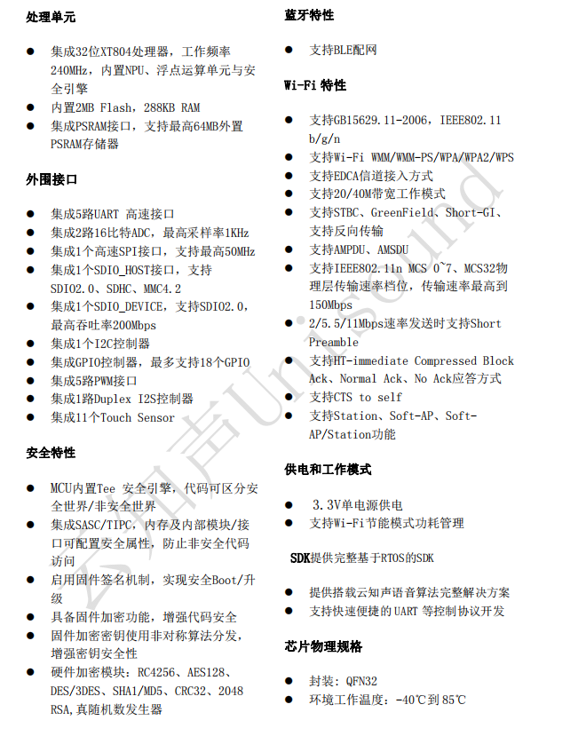

# 蜂鸟W

## 简介

&emsp;&emsp;US615U6芯片是一款安全 、Wi-Fi/蓝牙双模智能语音IoT芯片。支持2.4G IEEE802.11b/g/n Wi-Fi通讯协议；支持BLE配网。芯片集成32位CPU处理器，内置UART、GPIO、SPI、SDIO、I2C、I2S、ADC、TouchSensor 等外围接口；支持TEE 安全引擎，支持多种硬件加解密算法，内置 DSP、浮点运算单元与安全引擎，支持代码安全权限设置，支持固件加密存储、固件签名、安全调试、安全升级等多项安全措施，保证产品安全特性。依托于云知声在语音识别技术上的积累和算法的不断优化和创新，将本地识别算法与芯片架构深度融合，为客户提供 Turnkey 语音识别方案。 &emsp;&emsp;该芯片采用 MCU 加语音识别专用 NPU 架构内核，同时芯片内置 SRAM 和 FLASH，只需少量外围器件即可形成完整解决方案。 &emsp;&emsp;该方案支持 100 条本地指令离线 3-5 米远场识别，支持 RTOS 轻量级系统，并提供简洁友好的客制化工具，可快速部署到不同的终端产品上。  适用于用于智能家电、智能家居、智能玩具、无线音视频、工业控制、医疗监护等广泛
的物联网领域。

### 主要特点

## 文档下载

[蜂鸟W(US615) SOC产品手册.pdf](../../_static/document/Chip/fnW/%E8%9C%82%E9%B8%9FW(US615)%20SOC%E4%BA%A7%E5%93%81%E6%89%8B%E5%86%8C.pdf)

[蜂鸟W参考原理图.pdf](../../_static/document/Chip/fnW/%E8%9C%82%E9%B8%9FW%E5%8F%82%E8%80%83%E5%8E%9F%E7%90%86%E5%9B%BE.pdf)

[蜂鸟W芯片方案开发指导手册.chm](../../_static/document/Chip/fnW/%E8%9C%82%E9%B8%9FW%E8%8A%AF%E7%89%87%E6%96%B9%E6%A1%88%E5%BC%80%E5%8F%91%E6%8C%87%E5%AF%BC%E6%89%8B%E5%86%8C.chm)
