# SU-03T

[淘宝链接：https://shop379208868.taobao.com](https://shop379208868.taobao.com/?spm=a21ar.c-design.smart.5.46dfbdc5sKA2D8)

## 简介

### 概述

&emsp;&emsp;SU-03T 是一款低成本、低功耗、小体积的离线语音识别模组，能快速应用于智能家居，各类智能小家电，86 盒，玩具，灯具等需要语音操控的产品。

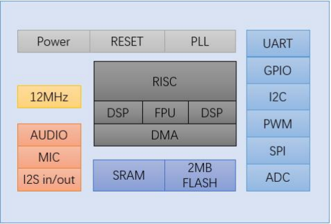

#### 外观尺寸

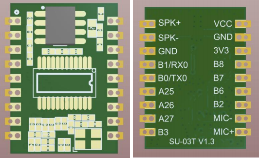

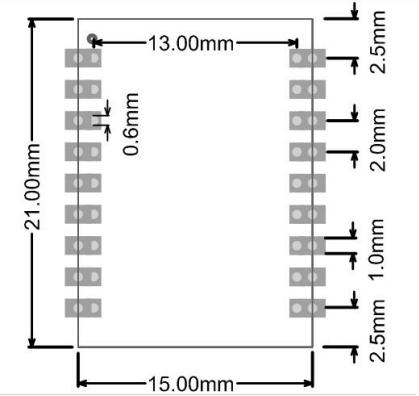

#### 特性

- 32bit RISC 内核，运行频率 240M
- 支持 DSP 指令集以及 FPU 浮点运算单元
- FFT 加速器：最大支持 1024 点复数 FFT/IFFT 运算，或者是 2048 点 的实数 FFT/IFFT 运算
- 内置高速 SRAM，内置 2MB FLASH
- 内置 2.4W、单声道 AB 类功放
- 支持 1 路驻极体麦
- 支持 I2S input/output
- 支持 5V 电源输入
- 内置 5V 转 3.3V，3.3V 外部负载不超过 150mA
- RC 12MHz 时钟源和 PLL 锁相环时钟源
- 内置 POR（Power on Reset），低电压检测和看门狗
- 所有 GPIO 均可配置为外部中断输入和唤醒源
- 1 个标准 SPI Master 接口，最高速率 30MHz
- 1 个 SPI Slave 接口最高速率 30MHz
- 1 个全双工 UART 最高速率 3Mbps，串口电压 3.3V
- 1 个 I2C 主/从控制器最高速率 400kHz
- 2 个 PWM 输出
- 1 个 12-bit SAR-ADC 最大 450Khz 采样率

#### 主要参数

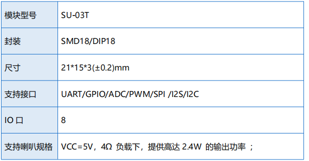
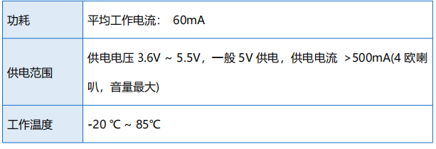

### 管脚定义

SU-03T 模组共接出 18 个接口，如图 2.1，表 2.2 是接口定义。
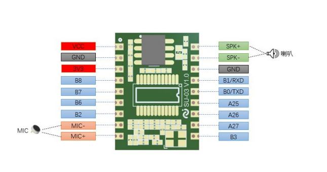
 **注意：UART0 串口 B0,B1 引脚是调试器的烧录口，串口烧录使用 UART1 （B6，B7 脚），B2/B3 为升级狗烧录/脱机烧录（建议生产使用），具体烧 录方式查看烧录文档。**
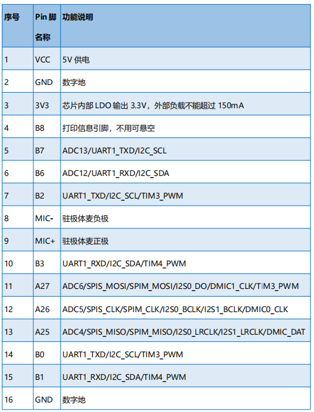
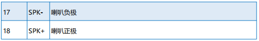

### 电气参数

#### 电气特性

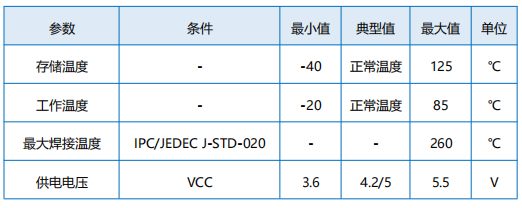

### 回流焊曲线图

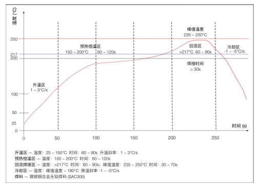

### 应用电路

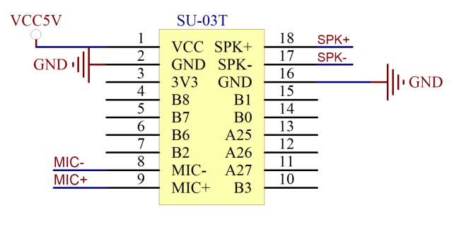

## 文档下载

[SU-03T模组规格书V1.3.pdf](../../_static/document/SU-03T/SU-03T%E6%A8%A1%E7%BB%84%E8%A7%84%E6%A0%BC%E4%B9%A6V1.3.pdf)

[SU-03T原理图.pdf](../../_static/document/SU-03T/SU-03T%E5%8E%9F%E7%90%86%E5%9B%BE.pdf)

[SU-03T开发板规格书V1.0.pdf](../../_static/document/SU-03T/SU-03T%E5%BC%80%E5%8F%91%E6%9D%BF%E8%A7%84%E6%A0%BC%E4%B9%A6V1.0.pdf)

[SU-03T开发板原理图V2.1.pdf](../../_static/document/SU-03T/SU-03T_EVB%20SCH%20V2.1.pdf)

[SU-03T技术开发手册v1.2.pdf](../../_static/document/SU-03T/SU-03T%E6%8A%80%E6%9C%AF%E6%89%8B%E5%86%8Cv1.2.pdf)

[SU-03T技术开发手册v1.2.chm](../../_static/document/SU-03T/SU-03T%E6%8A%80%E6%9C%AF%E5%BC%80%E5%8F%91%E6%89%8B%E5%86%8Cv1.2.chm)

[二次开发文档.zip](../../_static/document/SU-03T/%E4%BA%8C%E6%AC%A1%E5%BC%80%E5%8F%91%E6%96%87%E6%A1%A3.zip)

## 串口调试工具

[SSCOM_v5.13.1串口调试工具.rar](../../_static/document/SU-03T/SSCOM_v5.13.1%E4%B8%B2%E5%8F%A3%E8%B0%83%E8%AF%95%E5%B7%A5%E5%85%B7.rar)

## 烧录资料

[烧录注意事项.txt](../../_static/document/SU-03T/%E7%83%A7%E5%BD%95%E6%B3%A8%E6%84%8F%E4%BA%8B%E9%A1%B9.txt)

[脱机烧录软件.rar](../../_static/document/SU-03T/%E8%84%B1%E6%9C%BA%E7%83%A7%E5%BD%95%E8%BD%AF%E4%BB%B6.rar)

## 出厂固件

[小智SDK固件&串口烧录&调试器烧录.zip](../../_static/document/SU-03T/%E5%B0%8F%E6%99%BASDK%E5%9B%BA%E4%BB%B6%26%E4%B8%B2%E5%8F%A3%E7%83%A7%E5%BD%95%26%E8%B0%83%E8%AF%95%E5%99%A8%E7%83%A7%E5%BD%95.zip)

## 芯片资料

[蜂鸟M](../chip/M.md)
