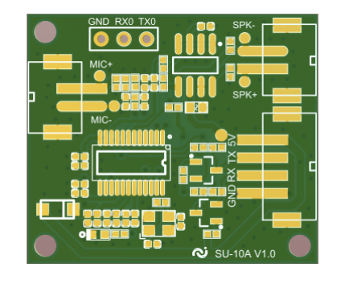

# SU-10A

[淘宝链接：https://shop379208868.taobao.com](https://shop379208868.taobao.com/?spm=a21ar.c-design.smart.5.46dfbdc5sKA2D8)

## 简介

### 概述

&emsp;&emsp;SU-10A 是一款低成本、低功耗、小体积的离线语音识别模组，能快速应用于智能家
居，各类智能小家电，86 盒，玩具，灯具等需要语音操控的产品。

### 外观尺寸

### 特性

- 32bit RISC 内核，运行频率 240M
- 支持 DSP 指令集以及 FPU 浮点运算单元
- FFT 加速器：最大支持 1024 点复数 FFT/IFFT 运算，或者是 2048 点
的实数 FFT/IFFT 运算
- 内置高速 SRAM，内置 2MB FLASH
- 内置 3W、单声道 AB 类功放
- 支持 1 路驻极体麦
- 支持 5V 电源输入
- UART 接口的电压默认 5V，也可支持 3.3V

### 主要参数

## 文档下载

[SU-10A模组规格书V1.0.pdf](../../_static/document/SU-10A/SU-10A%E6%A8%A1%E7%BB%84%E8%A7%84%E6%A0%BC%E4%B9%A6V1.0.pdf)

[SU-10A原理图V1.1.pdf](../../_static/document/SU-10A/SU-10A%E5%8E%9F%E7%90%86%E5%9B%BEV1.1.pdf)

[离线方案开发指导手册.pdf](../../_static/document/SU-10A/%E7%A6%BB%E7%BA%BF%E6%96%B9%E6%A1%88%E5%BC%80%E5%8F%91%E6%8C%87%E5%AF%BC%E6%89%8B%E5%86%8C.pdf)

[二次开发环境搭建.pdf](../../_static/document/SU-10A/%E7%8E%AF%E5%A2%83%E6%90%AD%E5%BB%BA.pdf)

## 串口调试工具

[SSCOM_v5.13.1串口调试工具.rar](../../_static/document/SU-10A/SSCOM_v5.13.1%E4%B8%B2%E5%8F%A3%E8%B0%83%E8%AF%95%E5%B7%A5%E5%85%B7.rar)

## 芯片资料

[蜂鸟M](../chip/M.md)
