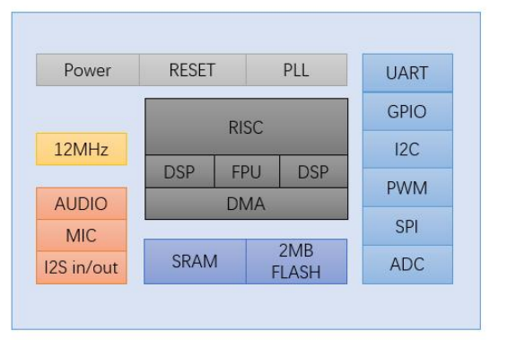
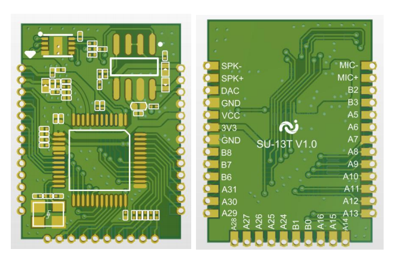
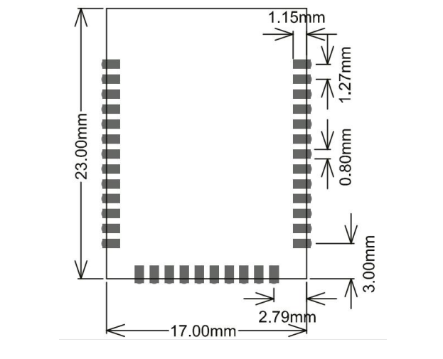
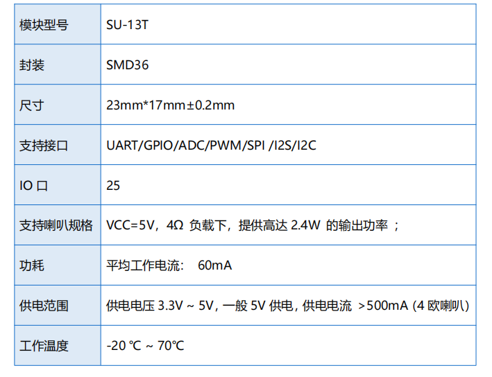

# SU-13T

[淘宝链接：https://shop379208868.taobao.com](https://shop379208868.taobao.com/?spm=a21ar.c-design.smart.5.46dfbdc5sKA2D8)

## 简介

### 产品概述

&emsp;&emsp;SU-13T 是一款低成本、低功耗、小体积的离线语音识别模组，该模块语音芯片采用 32bit RSIC 架构内核，并加入了专门针对信号处理和语音识别所需要的 DSP 指令集，支 持浮点运算的 FPU 运算单元，以及 FFT 加速器。该方案支持 150 条本地指令离线识别， 支持 RTOS 轻量级系统，具有丰富的外围接口，以及简单友好的客制化工具。能快速应 用于智能家居，各类智能小家电，86 盒，玩具，灯具等需要语音操控的产品。例如风扇、 智能门锁、扫地机、智能 台灯、智能空调、智能茶壶等产品。

### 外观尺寸

### 特性

- 32bit RISC 内核，运行频率 240M
- 支持 DSP 指令集以及 FPU 浮点运算单元
- FFT 加速器：最大支持 1024 点复数 FFT/IFFT 运算，或者是 2048 点 的实数 FFT/IFFT 运算
- 内置高速 SRAM，内置 2MB FLASH
- 内置 2.4W、单声道 AB 类功放
- 支持 1 路驻极体麦
- 支持 I2S input/output
- 支持 5V 电源输入
- 内置 5V 转 3.3V，3.3V 外部负载不超过 150mA
- RC 12MHz 时钟源和 PLL 锁相环时钟源
- 内置 POR（Power on Reset），低电压检测和看门狗
- 所有 GPIO 均可配置为外部中断输入和唤醒源
- 1 个标准 SPI Master 接口，最高速率 30MHz
- 1 个 SPI Slave 接口最高速率 30MHz
- 1 个全双工 UART 最高速率 3Mbps，串口电压 3.3V
- 1 个 I2C 主/从控制器最高速率 400kHz
- 2 个 PWM 输出
- 1 个 12-bit SAR-ADC 最大 450Khz 采样率

### 主要参数

## 文档下载

[SU-13T模组规格书V1.0.pdf](../../_static/document/SU-13T/SU-13T%E6%A8%A1%E7%BB%84%E8%A7%84%E6%A0%BC%E4%B9%A6V1.0.pdf)

[SU-13T原理图V1.0.pdf](../../_static/document/SU-13T/SU-13T%E5%8E%9F%E7%90%86%E5%9B%BEV1.0.pdf)

## 烧录资料

[SU-13T烧录资料.zip](../../_static/document/SU-13T/SU-13T%E7%83%A7%E5%BD%95%E8%B5%84%E6%96%99.zip)

## 芯片资料

[蜂鸟M-T](../chip/MT.md)
