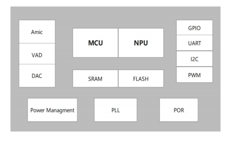
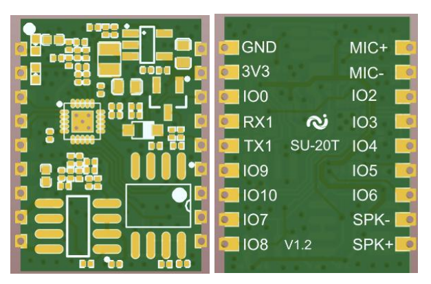
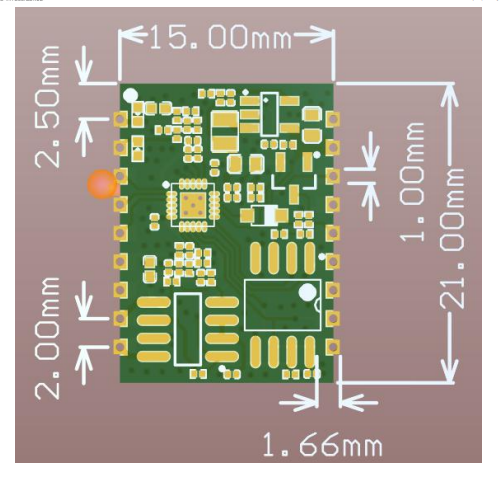
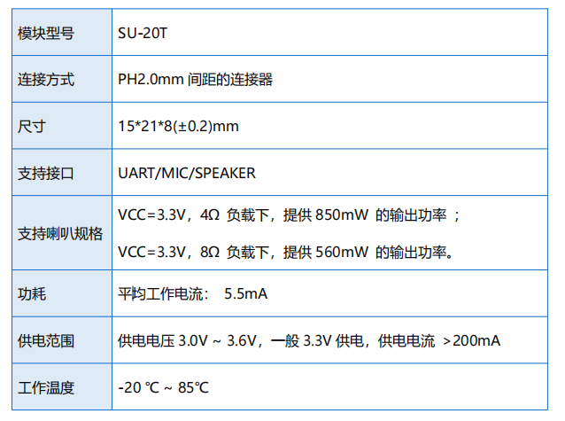

# SU-20T

[淘宝链接：https://shop379208868.taobao.com](https://shop379208868.taobao.com/?spm=a21ar.c-design.smart.5.46dfbdc5sKA2D8)

## 简介

### 产品概述

&emsp;&emsp;SU-20T 是一款低成本、低功耗、小体积的离线语音识别模组，内置高精度语音检测模块 配合系统多级启动模式使芯片待机功耗进入亚毫瓦级，工作功耗几毫瓦级别，能快速应用于智能家居， 各类智能小家电，86 盒，玩具，灯具等需要语音操控的产品。

### 外观尺寸

### 特性

- 32bit 低功耗 RISC 内核 MCU 最高频率 50M
- 支持 DSP 指令集以及 FPU 浮点运算单元
- 低功耗语音专用 NPU(神经网络处理单元)
- 内集成 208KB SRAM ，内置 512KB FLASH，外置 2M FLASH
- 内置 3W、单声道 AB 类功放
- 支持 1 路驻极体麦，1 路喇叭
- 支持 3.3V 电源输入
- UART 接口的电压 3.3V

### 主要参数

## 文档下载

[SU-20T模组规格书V1.1.pdf](../../_static/document/SU-20T/SU-20T%E6%A8%A1%E7%BB%84%E8%A7%84%E6%A0%BC%E4%B9%A6V1.1.pdf)

[SU-20T烧录文档.doc](../../_static/document/SU-20T/SU-20T%E7%83%A7%E5%BD%95%E6%96%87%E6%A1%A3.doc)

## 芯片资料

[蜂鸟L](../chip/L.md)
