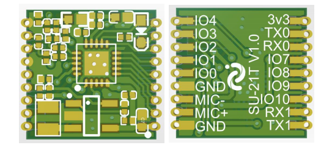
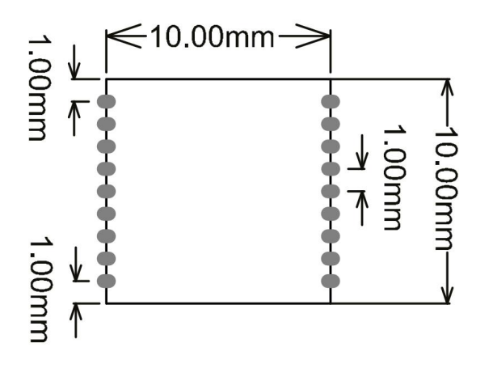

# SU-21T

[淘宝链接：https://shop379208868.taobao.com](https://shop379208868.taobao.com/?spm=a21ar.c-design.smart.5.46dfbdc5sKA2D8)

## 简介

### 产品概述

&emsp;&emsp;SU-21T 是一款低成本、小体积、低功耗的离线语音识别模组，完美嵌套各类 PCB， 内置高精度语音检测模块配合系统多级启动模式使芯片待机功耗进入亚毫瓦级，工作功 耗几毫瓦级别，能快速应用于智能家居，各类智能小家电，86 盒，玩具，灯具等需要语 音操控的产品。

### 外观尺寸

### 特性

- 32bit 超低功耗 RISC 内核 MCU 最高频率 50M
- 支持 DSP 指令集以及 FPU 浮点运算单元
- 低功耗语音专用 NPU(神经网络处理单元)
- 内集成 208KB SRAM ，内置 1M FLASH
- 支持 1 路驻极体麦
- 支持 3.3V 电源输入
- UART 接口的电压 3.3V

### 主要参数

## 文档下载

[SU-21T模组规格书V1.0.pdf](../../_static/document/SU-21T/SU-21T%E6%A8%A1%E7%BB%84%E8%A7%84%E6%A0%BC%E4%B9%A6V1.0.pdf)

[SU-21T原理图V1.0.pdf](../../_static/document/SU-21T/SU-21T%E5%8E%9F%E7%90%86%E5%9B%BEV1.0.pdf)

## 烧录资料

[SU-21T烧录资料.zip](../../_static/document/SU-21T/SU-21T%E7%83%A7%E5%BD%95%E8%B5%84%E6%96%99.zip)

## 芯片资料

[蜂鸟L](../chip/L.md)
