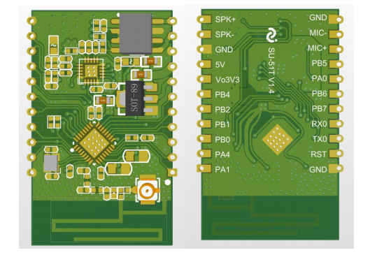

# SU-51T

[淘宝链接：https://shop379208868.taobao.com](https://shop379208868.taobao.com/?spm=a21ar.c-design.smart.5.46dfbdc5sKA2D8)

## 简介

### 概述

&emsp;&emsp;SU-51T 是基于 US615U6 芯片研发的一款离线+IOT 语音识别模组，支持 2.4G IEEE802.11b/g/n Wi-Fi 通讯协议；支持 BLE 配网。该语音模组具有丰富的系统外设资 源，包括 UART、GPIO、SPI、SDIO、I2C、I2S、ADC、TouchSensor 等，适用于用于智能 家电、智能家居、智能玩具、无线音视频、工业控制、医疗监护等广泛的物联网领域。

### 外观尺寸

### 特性

- 集成 32 位 XT804 处理器，工作频率 240MHz，内置 NPU、浮点运算 单元与安全引擎
- 内置 2MB Flash，288KB RAM
- 集成 PSRAM 接口，支持最高 64MB 外置 PSRAM 存储器
- 集成 5 路 UART 高速接口
- 集成 2 路 16 比特 ADC，最高采样率 1KHz
- 集成 1 个高速 SPI 接口，支持最高 50MHz
- 集成 1 个 SDIO_HOST 接口，支持 SDIO2.0、SDHC、MMC4.2
- 集成 1 个 SDIO_DEVICE，支持 SDIO2.0，最高吞吐率 200Mbps
- 集成 1 个 I2C 控制器
- 集成 GPIO 控制器，最多支持 18 个 GPIO
- 集成 5 路 PWM 接口
- 集成 1 路 Duplex I2S 控制器
- 集成 7 个 Touch Sensor
- MCU 内置 Tee 安全引擎，代码可区分安全世界/非安全世界
- 集成 SASC/TIPC，内存及内部模块/接口可配置安全属性，防止非安全代 码访问
- 启用固件签名机制，实现安全 Boot/升级
- 具备固件加密功能，增强代码安全
- 固件加密密钥使用非对称算法分发，增强密钥安全性
- 硬件加密模块：RC4256、AES128、DES/3DES、SHA1/MD5、CRC32、 2048 RSA,真随机数发生器
- 支持 BLE 配网
- 支持 GB15629.11-2006，IEEE802.11 b/g/n
- 支持 Wi-Fi WMM/WMM-PS/WPA/WPA2/WPS
- 支持 EDCA 信道接入方式
- 支持 20/40M 带宽工作模式
- 支持 STBC、GreenField、Short-GI
- 支持反向传输
- 支持 AMPDU、AMSDU
- 支持 IEEE802.11n MCS 0~7、MCS32 物理层传输速率档位，传输速率 最高到 150Mbps
- 2/5.5/11Mbps 速率发送时支持 Short Preamble
- 支持 HT-immediate Compressed Block Ack、Normal Ack、No Ack 应答方式
- 支持 CTS to self
- 支持 Station、Soft-AP、SoftAP/Station 功能

### 主要参数

## 文档下载

[SU-51T模组规格书V1.0.pdf](../../_static/document/SU-51T/SU-51T%E6%A8%A1%E7%BB%84%E8%A7%84%E6%A0%BC%E4%B9%A6V1.0.pdf)

## 芯片资料

[蜂鸟W](../chip/W.md)
