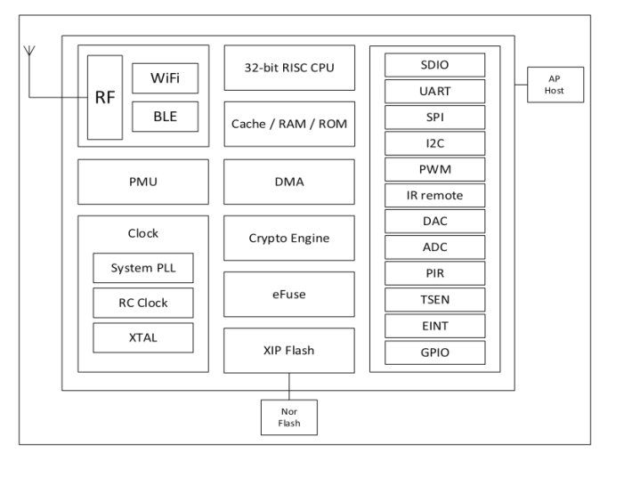

# BL-62B

[淘宝链接：https://shop379208868.taobao.com](https://shop379208868.taobao.com/?spm=a21ar.c-design.smart.5.46dfbdc5sKA2D8)

## 简介

&emsp;&emsp;BL-62B 是一款基于 WiFi+BLE 单芯片 SoC 为主控的无线模组，它可以满足低功耗和高性能的 IOT 应用开发，该模组核心处理器 BL602 集成了 2.4G Wi-Fi （802.11b/g/n） 和BLE 5.0 的基带和 MAC 设计。其微控制器子系统包含一个低功耗的 32 位 RISC CPU，高速缓存和存储器。具有先进的电源管理单元，支持多种低功耗模式。外围接口包括 UART，GPIO，ADC，DAC，PWM，I2C，SDIO，SPI，IR 远程等。

## 文档下载

[BL-62B模组规格书V1.2.pdf](../../_static/document/BL-62B/BL-62B%E6%A8%A1%E7%BB%84%E8%A7%84%E6%A0%BC%E4%B9%A6V1.2.pdf)

[BL62B_EVB开发板用户指南V1.1.pdf](../../_static/document/BL-62B/BL62B_EVB%E5%BC%80%E5%8F%91%E6%9D%BF%E7%94%A8%E6%88%B7%E6%8C%87%E5%8D%97V1.1.pdf)
